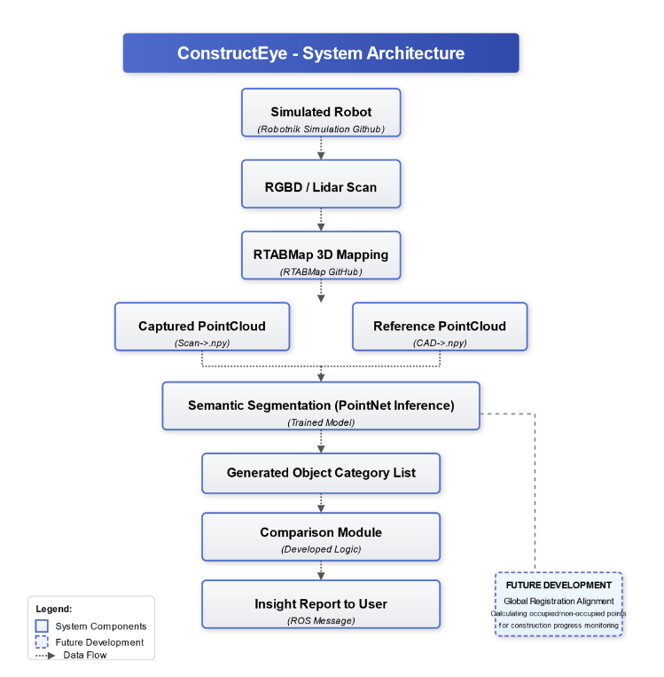

# ConstructEye - AI-Driven Autonomous Mobile Robotics For 3D Construction Progress Monitoring

**ConstructEye** is an AI-powered mobile robotic system designed to automate construction progress monitoring using semantic segmentation and 3D point cloud analysis.

Developed by **Ashiwin Rajendran**, this project aims to replace manual and error-prone site inspection methods with a robotics-based digital twin system that captures, segments, and compares structural progress using deep learning.

---

## Project Overview

Traditional methods for tracking construction progress rely heavily on manual inspection, which is time-consuming, labor-intensive, and prone to human error. **ConstructEye** addresses these challenges by integrating mobile robotics with semantic scene understanding powered by deep learning.

A mobile robot equipped with LiDAR and RGB-D sensors autonomously navigates the environment and generates dense 3D point clouds of the site. These are semantically segmented using a deep neural network (PointNet), and compared against reference 3D CAD models to assess construction completeness and highlight deviations from planned structures.

The pipeline supports both indoor and outdoor environments.

---

## System Architecture

The full ConstructEye architecture includes:

* Reference model from CAD -> URDF -> NPY
* Robot Simulation (Gazebo + RViz)
* SLAM Mapping using RTAB-Map
* PointCloud Data Collection -> NPY
* Semantic Segmentation using PointNet
* PointCloud comparison and visualization
* ROS-based orchestration and services
* Dockerized deployment



For detailed setup instructions, refer to the [ConstructEye\_Readme.pdf](./ConstructEye_Readme.pdf).

---

## Robot Simulation and Mapping

The reference model generation, simulation and RTAB-Map setups are described in the linked PDF. It outlines the integration of the mobile robot, teleoperation, and SLAM to generate real-time point cloud maps in a simulated construction environment.

---

## PointNet: Deep Learning on Point Sets for 3D Semantic Segmentation

This project uses PointNet for segmenting raw point clouds.

### Reference

Created by <a href="http://charlesrqi.com" target="_blank">Charles R. Qi</a>, <a href="http://ai.stanford.edu/~haosu/" target="_blank">Hao Su</a>, <a href="http://cs.stanford.edu/~kaichun/" target="_blank">Kaichun Mo</a>, <a href="http://geometry.stanford.edu/member/guibas/" target="_blank">Leonidas J. Guibas</a>.

Paper: [arXiv:1612.00593](https://arxiv.org/abs/1612.00593)

### Why PointNet?

PointNet directly consumes unordered point sets without voxelization or 2D projection. This makes it highly efficient and robust for per-point classification and segmentation tasks.

---

## Dataset Used

* **Stanford 3D Indoor Scene Dataset (S3DIS)**

  * 6 large areas
  * 271 rooms
  * 13 semantic classes

---

## Installation

Install TensorFlow and h5py (The code has been tested with Python 2.7, TensorFlow 1.0.1, CUDA 8.0 and cuDNN 5.1 on Ubuntu 14.04.):

```bash
sudo apt-get install libhdf5-dev
pip install tensorflow-gpu==1.15 h5py
```

---

## Training Setup

1. Prepare your Conda environment:

   ```bash
   conda create -n tf1.15 python=3.7
   conda activate tf1.15
   ```

2. Download prepared HDF5 data:

   ```bash
   sh download_data.sh
   ```

   Download 3D indoor parsing dataset (<a href="http://buildingparser.stanford.edu/dataset.html">S3DIS Dataset</a>) for testing and visualization. Version 1.2 of the dataset is used in this work.

   To prepare your own HDF5 data, you need to firstly download 3D indoor parsing dataset and then use `python collect_indoor3d_data.py` for data re-organization and `python gen_indoor3d_h5.py` to generate HDF5 files.

3. Train the PointNet model:

   ```bash
   python train.py --log_dir log6 --test_area 6
   ```
---

## Testing and Inference

Use the following command to perform inference and generate OBJ visualization files:

```bash
python batch_inference.py --model_path log6/model.ckpt \
--dump_dir log6/dump --output_filelist log6/output_filelist.txt \
--room_data_filelist meta/area6_data_label.txt --visu
```

6-fold cross-validation can be used to evaluate different test areas.

To evaluate overall segmentation accuracy, we evaluate 6 models on their corresponding test areas and use `eval_iou_accuracy.py` to produce point classification accuracy and IoU as reported in the original paper.

---

## ROS Integration

The trained inference script has been integrated into a custom ROS package (`indoor_scan`) inside a workspace (`sensing_ws`). When the ROS service is called, the inference runs automatically on the selected point cloud file (either reference or scanned).

All modules have been customized to align with the overall pipeline structure.

---

## Docker Deployment

Note: The complete Docker image is not included.

However, the readme and code structure provide the necessary steps for replicating the pipeline, training the models, and setting up ROS services for semantic segmentation and monitoring.

---

This repository offers an end-to-end view of the ConstructEye solution and can be extended for real-world implementation with mobile robots or drones.
